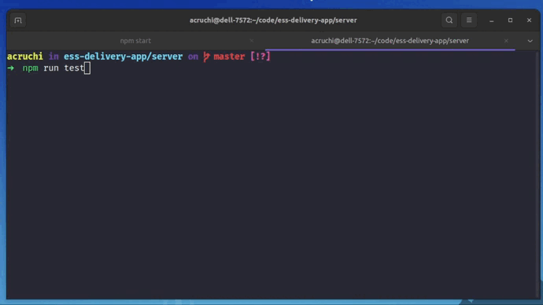

## Testes do Backend

### Demonstração



### Dependências

- [Jasmine](https://jasmine.github.io/)

### Rodando os testes
Certifique-se que o server não está rodando e execute o seguinte comando dentro da pasta server: 
```
npm run test
```