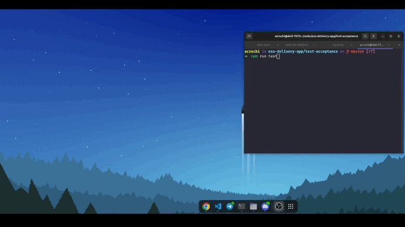

## Testes de Aceitação

### Demonstração



### Dependências

- [Java (JDK)](https://www.digitalocean.com/community/tutorials/how-to-install-java-with-apt-on-ubuntu-22-04)
- Node 14.20
- Protractor
- Cucumber
- Selenium

### Instalando as dependências
Na pasta do projeto:
```
cd test-acceptance
npm install
```
Atualizando o Webdriver
```
npm run webdriver-update
```
Iniciando o Webdriver
```
npm run webdriver-start
```

### Rodando os testes
Com o backend (server), o frontend e o webdriver rodando, execute o seguinte comando dentro da pasta test-acceptance: 
```
npm run test
```